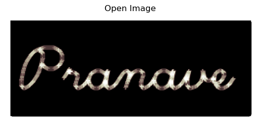

# Opening-and-Closing

## Aim
To implement Opening and Closing using Python and OpenCV.

## Software Required
1. Anaconda - Python 3.7
2. OpenCV
## Algorithm:
### Step1:

Import the necessary packages.

### Step2:

Create the Text using cv2.putText.

### Step3:

Create the sturcturing element kernel via autogeneration for opening and closing using :
```Python
kernel = cv2.getStructuringElement(cv2.MORPH_CROSS, kernelsize)
```

### Step4:

Implement Opening and Closing over the image using cv2.morphologyEx().

### Step5:

Display the result Image.

 
## Program:

```
Developed By: Pranave B
Register  No: 212221240040
```

``` Python
# Import the necessary packages

import cv2
import matplotlib.pyplot as plt
import numpy as np

# Create the Text using cv2.putText

text_image = np.zeros((100,250), dtype = 'uint8')
font = cv2.FONT_HERSHEY_SCRIPT_SIMPLEX
cv2.putText(text_image, 'Pranave',(5,70),font,2,255,2,cv2.LINE_AA)     
plt.imshow(text_image,'bone')
plt.axis('off')


# Create the structuring element

kernelsize = (8, 8)
kernel = cv2.getStructuringElement(cv2.MORPH_CROSS, kernelsize)

# Use Opening operation

open_image = cv2.morphologyEx(image, cv2.MORPH_OPEN, kernel)


# Use Closing Operation

close_image = cv2.morphologyEx(image, cv2.MORPH_CLOSE, kernel)


```
## Output:

### Display the input Image


### Display the result of Opening



### Display the result of Closing


## Result
Thus the Opening and Closing operation is used in the image using python and OpenCV.
